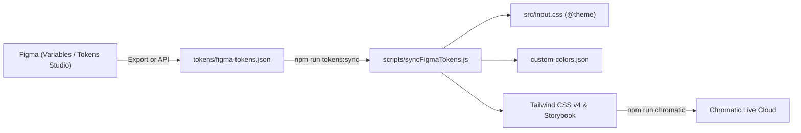

# 🎨 Figma ➔ ThemeUI 디자인 토큰 파이프라인 가이드

본 문서는 피그마(Figma)에서 정의한 디자인 가이드(Color, Radius, Spacing)를 `ThemeUI` 디자인 시스템과 실시간 동기화하고 배포하는 전체 파이프라인 매뉴얼입니다.

---

## 1. 전체 파이프라인 구조



---

## 2. Figma에서 토큰 정의 규칙 (Naming Conventions)

피그마의 **Variables** 또는 **Tokens Studio** 플러그인에서 아래와 같은 계층 구조로 토큰을 작성합니다:

### 2-1. Color (색상)
* `color/primary/base` 또는 `color/primary/500`: 브랜드 메인 컬러
* `color/primary/50` ~ `color/primary/950`: (선택) 단계별 팔레트 (지정하지 않을 경우 단일 Hex로부터 50~950 자동 계산 생성)
* `color/secondary/base` 또는 `color/secondary/500`: 보조 컬러
* `color/neutral/base`: 기본 중립/텍스트 컬러

### 2-2. Border Radius (곡률)
* `radius/sm`: `2px` (0.125rem)
* `radius/md`: `6px` (0.375rem)
* `radius/lg`: `8px` (0.5rem)
* `radius/full`: `9999px`

### 2-3. Spacing (간격)
* `spacing/xs`: `4px`
* `spacing/sm`: `8px`
* `spacing/md`: `16px`
* `spacing/lg`: `24px`

---

## 3. 동기화 실행 방법 (2가지 옵션)

### 방법 A. 피그마에서 JSON 파일로 내보내기 (가장 쉬운 방법)
1. 피그마 플러그인(**Tokens Studio for Figma** 또는 **Export/Import Variables**) 실행
2. JSON 파일로 내보내기(Export)
3. 다운로드한 파일을 프로젝트의 **`tokens/figma-tokens.json`** 경로에 덮어쓰기
4. 터미널에서 동기화 명령어 실행:
   ```bash
   npm run tokens:sync
   ```
5. 결과: `src/input.css`의 `@theme` 및 Tailwind 팔레트가 즉시 갱신됩니다!

---

### 방법 B. Figma REST API를 통한 원클릭 자동 동기화
피그마 Personal Access Token과 File Key가 있는 경우 명령어 한 줄로 피그마 클라우드에서 직접 긁어옵니다:

```bash
# Windows PowerShell
$env:FIGMA_ACCESS_TOKEN="<본인의_피그마_액세스_토큰>"
$env:FIGMA_FILE_KEY="<피그마_URL에_있는_파일_키>"
npm run tokens:fetch
```

---

## 4. 원클릭 배포 파이프라인 (`tokens:pipeline`)

피그마 토큰 동기화부터 Chromatic 클라우드 라이브 배포까지 한 번에 실행:

```bash
npm run tokens:pipeline
```

이 명령어 하나로:
1. `tokens/figma-tokens.json` 파싱
2. `src/input.css`의 `@theme` CSS 변수 자동 주입
3. Tailwind v4 컴파일 트리거
4. Chromatic으로 새 UI 스냅샷 자동 배포 및 버전 관리가 완료됩니다.
